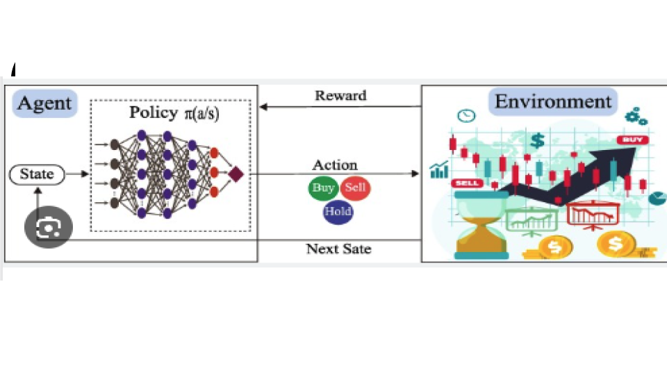

<div align="center">
<h3>
<br>
        
    [OverView](/docs/MD/OverView.md) |
    [DOW Stable Base Line](/docs/MD/StableBasdelineDowJones.md) |
    [Trading Experiments](/docs/MD/READMExperiment.md) |
    [PaperTrading](/docs/MD/READMExpAlpacaPaperTrading.md) | 
    [](/docs/MD/)
    [FAQ](/docs/MD/READMEfaq.md) | 
    [SnapShot](/docs/MD/READMECodeSnapShot.md) 

</h3>
</div>
# Renforced Learning Trading Bot
<h2 align="center">
 <br>
 
 <br>
 </h2>
 JojoFin with  the three layers: market environments, agents, and applications. For a trading task (on the top), an agent (in the middle) interacts with a market environment (at the bottom), making sequential decisions.
<br>

<div align="center">

[Introduction](OVERVIEW) |
[SnapShot](READMECodeSnapShot.md) | 
[PaperTrading](READMExpAlpacaPaperTrading.md) | 
[FAQ](READMEfaq.md)
</div>

## Introduction

If you're tired staring at charts all day, and doing trades manually while exploring daily market data
just relax and let the bot do all the hard work.
This Trading-bot operates 24/7, ensuring no trading opportunities are missed. An AI JOJO Trading Bot offers the benefits of automated trading without needing constant attention, giving regular investors a chance for higher returns. 
The name of the AI trading bot is JojoFin. It is like having an automatic helper that trades for you 24/7 based on set rules, quickly making lots of small trades to profit from market changes, while traditional investing involves buying assets and holding them for a long time with less frequent trades and lower risk.
## Reinforcement Learning (RL)
Reinforcement Learning (RL) techniques are considered convenient for this task : 
In this experiment, we present an RL environment for the portfolio optimization based on state-of-the-art mathematical formulations. The environment aims to be easy-to-use, very customizable, and have integrations with modern RL frameworks.
Jojobot is a library that will allow you to easily create trading robots that are profitable in many different asset classes, including Stocks, Options, Futures, FOREX, and more. 
Check your trading strategies against historical data to make sure they are profitable before you invest in them. JojoBot makes it easy for you to do  (backtest) your trading strategies and easily convert them to algorithmic trading robots.
<br>

## Experiment Overview
1. Pull 1 year of trading data for (Insert your stock, options or crypto) with Yahoo Finance Downloader API
2. Create a simulated trading environment using real trading data.
3. Train an neural network to predict that Stock Price using reinforcement learning inside this simulation with FinRL
4. Once trained, backtest the predictions on the past 30 days data to compute potential returns with FinRL
5. If the expectd returns are above a certain threshold, buy, else hold. If they're below a certain threshold, sell. (using Alpaca API)

In order to have this to run automatically once a day, we can deploy it to a hosting platform like Vercel with a seperate file that repeatedly executes it. 

## Dependencies 

- [Python 3  ](https://www.python.org/downloads/)
- [Alpaca SDK](https://alpaca.markets/)
- [Vercel](https://vercel.com)

#### from config file, TRAIN , TEST and TRADE days
```python
TRAIN_START_DATE = '2010-01-01'
TRAIN_END_DATE = '2021-10-01'
TRADE_START_DATE = '2021-10-01'
TRADE_END_DATE = '2023-03-01'
```
#### Yahoo donloader for data frames collection from Start Train to End Tradedate
```python
df = YahooDownloader(start_date = TRAIN_START_DATE,
                      end_date = TRADE_END_DATE,
                      ticker_list = config_tickers.DOW_30_TICKER).fetch_data()
```     
#### Features Included DOW_30_TICKER - Technical, VIX and Turbelance INDICATORS, 
```python
fe = FeatureEngineer(
                      use_technical_indicator=True,
                      tech_indicator_list = INDICATORS,
                      use_vix=True,
                      use_turbulence=True,
                      user_defined_feature = False)
```  
#### Envionment Aeguments
```python
 env_kwargs = {
      "hmax": 100,
      "initial_amount": 1000000,
      "num_stock_shares": num_stock_shares,
      "buy_cost_pct": buy_cost_list,
      "sell_cost_pct": sell_cost_list,
      "state_space": state_space,
      "stock_dim": stock_dimension,
      "tech_indicator_list": INDICATORS,
      "action_space": stock_dimension,
      "reward_scaling": 1e-4
  }
  ```
#### Taining Agents Ensamble
```python
  
  models = {
      "a2c": trained_a2c,
      "ddpg": trained_ddpg,
      "ppo": trained_ppo,
      "td3": trained_td3,
      "sac": trained_sac
  }

  results = predict_with_models(models, e_trade_gym)
  # Access results for each model
  df_account_value_a2c = results["a2c"]["account_value"]
  df_account_value_ddpg = results["ddpg"]["account_value"]
  df_account_value_ppo = results["ppo"]["account_value"]
  df_account_value_td3 = results["td3"]["account_value"]
  df_account_value_sac = results["sac"]["account_value"]
  #### Taining Agents Ensamble
```
#### predict_with_models Ensamble
```python
  def predict_with_models(models, environment):
      for model_name, trained_model in models.items():
          df_account_value, df_actions = DRLAgent.DRL_prediction(
              model=trained_model,
              environment=environment
          )
          results[model_name] = {
              "account_value": df_account_value,
              "actions": df_actions
          }

      return results
```
## Tutorial

## Google Colab Notebooks

Examples for Stocks, Options, and Crypto in the notebooks provided below. Open them in Google Colab to jumpstart your journey! 

| Notebooks                                     |                                                                                    Open in Google Colab                                                                                    |
| :-------------------------------------------- | :----------------------------------------------------------------------------------------------------------------------------------------------------------------------------------------: |
| [Stocks Orders](stocks-trading-basic.ipynb)   | [](https://colab.research.google.com/github/alpacahq/alpaca-py/blob/master/examples/stocks-trading-basic.ipynb)  |
| [Options Orders](options-trading-basic.ipynb) | [](https://colab.research.google.com/github/alpacahq/alpaca-py/blob/master/examples/options-trading-basic.ipynb) |
| [Crypto Orders](crypto-trading-basic.ipynb)   | [](https://colab.research.google.com/github/alpacahq/alpaca-py/blob/master/examples/crypto-trading-basic.ipynb)  |
| [Stock Trading](api/tradingBot.ipynb)         |                                                 [](api/tradingBot.ipynb)                                                 |

## Features

- 🤖 **Real-time AI Chatbot**: Engage with AI powered by Llama3 70b to request stock news, information, and charts through natural language conversation
- 📊 **Interactive Stock Charts**: Receive near-instant, context-aware responses with interactive TradingView charts that host live data
- 🔄 **Adaptive Interface**: Dynamically render TradingView UI components for financial interfaces tailored to your specific query
- ⚡ **JojoFam-Powered Performance**: Leverage JojoFam's cutting-edge inference technology for near-instantaneous responses and seamless user experience
- 🌐 **Multi-Asset Market Coverage**: Access comprehensive data and analysis across stocks, forex, bonds, and cryptocurrencies