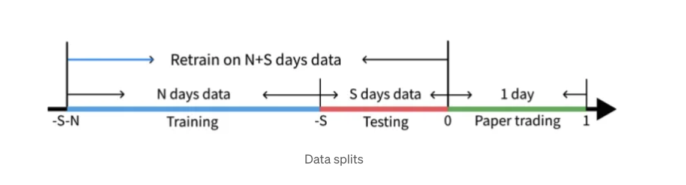
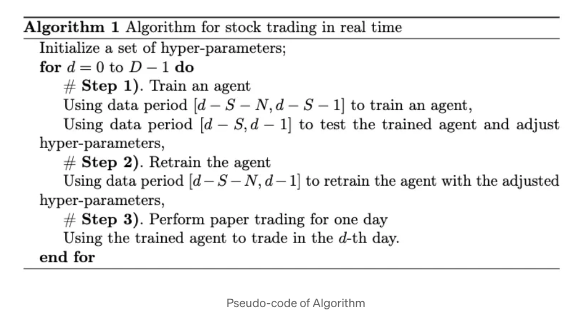
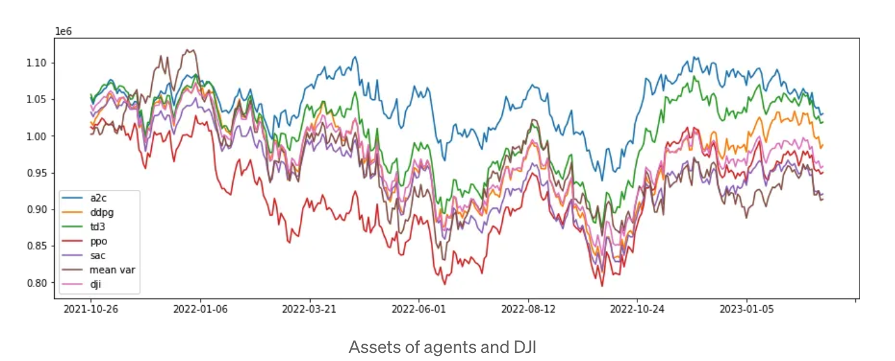

<div align="center">
<h2>

[Introduction](../../README.md) |
[DOW Stable Base Line](StableBasdelineDowJones.md) |
[OverView](OverView.md) |
[PaperTrading](READMExpAlpacaPaperTrading.md) | 
[Trading Experiments](READMExperiment.md) |
[TECH](/docs/MD/README.TECH.md) |
[FAQ](READMEfaq.md) | 
[SnapShot](READMECodeSnapShot.md) 

</h2>
</div>

# Stable baselines3 using Dow Jones Stock pool for Stock trading 

Library that uses deep reinforcement learning (DRL) for financial trading decision-making. Supports several DRL libraries, e.g., Stable Baselines3, and ElegantRL. Stable Baselines3 is a DRL library implemented in Python. 
It is built on top of the OpenAI Gym and provides a simple interface to train and evaluate DRL models. Hers, we use Dow Jones as a stock pool, and Stable baselines3 to train DRL agents.

# Dynamic Datasets Driven Financial Reinforcement Learning — Example

## 1 Task Discription Scenario and method

[ Market Environments and Benchmarks
for Data-Driven Financial Reinforcement Learning](https://proceedings.neurips.cc/paper_files/paper/2022/file/0bf54b80686d2c4dc0808c2e98d430f7-Paper-Datasets_and_Benchmarks.pdf)

[](https://docs.wandb.ai/guides/hosting/self-managed/basic-setup)
[wandb](https://github.com/wandb/wandb)

The financial dataset has the characteristics of real-time and periodicity. For financial transactions, especially high-frequency transactions, adjusting strategies based on changes in the dataset and making intelligent trading decisions can increase profits and stop losses in a timely manner.

Here  we take the Dow Jones 30 stocks as the stock pool, dynamically updates the dataset and training set to make dynamic data-driven intelligent decisions, and adjusts trading strategies in a timely manner based on market feedback.


For the MDP modeling of stock trading, please refer to the link and it will not be repeated here. Now, what we are concerned about is how to dynamically train strategies based on the use of dynamic datasets and then trade.


The pseudo-code is as following:



The general idea is to use the previous S+N days before each trading day as the training and testing set, where S days are used as the training dataset and N days are used as the testing dataset. As each day passes, the training and testing set will roll forward accordingly, forming a dynamic data-driven intelligent decision-making model. In actual scenarios, since the training set for deep reinforcement learning is large, the corresponding changes in the training set will be minimal if it is rolled forward by one day. Therefore, a rolling window W is set, and the rolling is performed every W days, where W is a hyperparameter that can be set by the user.


We train a DRL agent for stock trading. This task is modeled as a Markov Decision Process (MDP), and the objective function is maximizing (expected) cumulative return.

We specify the state-action-reward as follows:

### State s: 
The state space represents an agent’s perception of the market environment. Just like a human trader analyzing various information, here our agent passively observes many features and learns by interacting with the market environment by replaying historical data.

### Action a: 
The action space includes allowed actions that an agent can take at each state. For example, a ∈ {−1, 0, 1}, where −1, 0, 1 represent selling, holding, and buying. When an action operates multiple shares, a ∈{−k, …, −1, 0, 1, …, k}, e.g.. “Buy 10 shares of AAPL” or “Sell 10 shares of AAPL” are 10 or −10, respectively

### Reward function r(s, a, s′): 
Reward is an incentive for an agent to learn a better policy. For example, it can be the change of the portfolio value when taking a at state s and arriving at new state s’, i.e., r(s, a, s′) = v′ − v, where v′ and v represent the portfolio values at state s′ and s, respectively

### Market environment: 
30 consituent stocks of Dow Jones Industrial Average (DJIA) index. Accessed at the starting date of the testing period.

The data is obtained from Yahoo Finance API. The data contains Open-High-Low-Close price and volume.

## 2 Install and import

### 2.1 Install Python Packages

```python
## install required packages
!pip install swig
!pip install wrds
!pip install pyportfolioopt
## install finrl library
!pip install -q condacolab
import condacolab
condacolab.install()
!apt-get update -y -qq && apt-get install -y -qq cmake libopenmpi-dev python3-dev zlib1g-dev libgl1-mesa-glx swig
!pip install git+https://github.com/AI4Finance-Foundation/FinRL.git
```

2.2 Import packages and functions

```python
from finrl import config
from finrl import config_tickers
from finrl.agents.stablebaselines3.models import DRLAgent
from finrl.config import DATA_SAVE_DIR
from finrl.config import INDICATORS
from finrl.config import RESULTS_DIR
from finrl.config import TENSORBOARD_LOG_DIR
from finrl.config import TEST_END_DATE
from finrl.config import TEST_START_DATE
from finrl.config import TRAINED_MODEL_DIR
from finrl.config_tickers import DOW_30_TICKER
from finrl.main import check_and_make_directories
from finrl.meta.data_processor import DataProcessor
from finrl.meta.data_processors.func import calc_train_trade_data
from finrl.meta.data_processors.func import calc_train_trade_starts_ends_if_rolling
from finrl.meta.data_processors.func import date2str
from finrl.meta.data_processors.func import str2date
from finrl.meta.env_stock_trading.env_stocktrading import StockTradingEnv
from finrl.meta.preprocessor.preprocessors import data_split
from finrl.meta.preprocessor.preprocessors import FeatureEngineer
from finrl.meta.preprocessor.yahoodownloader import YahooDownloader
from finrl.plot import backtest_plot
from finrl.plot import backtest_stats
from finrl.plot import get_baseline
from finrl.plot import get_daily_return
from finrl.plot import plot_return
from finrl.applications.stock_trading.stock_trading import stock_trading
import sys
sys.path.append("../FinRL")

import itertools
```

### 3. Set parameters and run

```python
We set parameters for the function stock_trading, and run it. The code is here.

    train_start_date = "2009-01-01"
    train_end_date = "2022-09-01"
    trade_start_date = "2022-09-01"
    trade_end_date = "2023-11-01"
    if_store_actions = True
    if_store_result = True
    if_using_a2c = True
    if_using_ddpg = True
    if_using_ppo = True
    if_using_sac = True
    if_using_td3 = True

    stock_trading(
        train_start_date=train_start_date,
        train_end_date=train_end_date,
        trade_start_date=trade_start_date,
        trade_end_date=trade_end_date,
        if_store_actions=if_store_actions,
        if_store_result=if_store_result,
        if_using_a2c=if_using_a2c,
        if_using_ddpg=if_using_ddpg,
        if_using_ppo=if_using_ppo,
        if_using_sac=if_using_sac,
        if_using_td3=if_using_td3,
    )
```    

### 4 Result



## Appendix 1


The imported function stock_trading is pasted here for easy follow.

<details>
  <summary>Click to expand!</summary>

```python
def stock_trading(
        train_start_date: str,
        train_end_date: str,
        trade_start_date: str,
        trade_end_date: str,
        if_store_actions: bool = True,
        if_store_result: bool = True,
        if_using_a2c: bool = True,
        if_using_ddpg: bool = True,
        if_using_ppo: bool = True,
        if_using_sac: bool = True,
        if_using_td3: bool = True,
):


    sys.path.append("../FinRL")
    check_and_make_directories(
        [DATA_SAVE_DIR, TRAINED_MODEL_DIR, TENSORBOARD_LOG_DIR, RESULTS_DIR]
    )
    date_col = "date"
    tic_col = "tic"
    df = YahooDownloader(
        start_date=train_start_date, end_date=trade_end_date, ticker_list=DOW_30_TICKER
    ).fetch_data()
    fe = FeatureEngineer(
        use_technical_indicator=True,
        tech_indicator_list=INDICATORS,
        use_vix=True,
        use_turbulence=True,
        user_defined_feature=False,
    )

    processed = fe.preprocess_data(df)
    list_ticker = processed[tic_col].unique().tolist()
    list_date = list(
        pd.date_range(processed[date_col].min(), processed[date_col].max()).astype(str)
    )
    combination = list(itertools.product(list_date, list_ticker))

    init_train_trade_data = pd.DataFrame(
        combination, columns=[date_col, tic_col]
    ).merge(processed, on=[date_col, tic_col], how="left")
    init_train_trade_data = init_train_trade_data[
        init_train_trade_data[date_col].isin(processed[date_col])
    ]
    init_train_trade_data = init_train_trade_data.sort_values([date_col, tic_col])

    init_train_trade_data = init_train_trade_data.fillna(0)

    init_train_data = data_split(
        init_train_trade_data, train_start_date, train_end_date
    )
    init_trade_data = data_split(
        init_train_trade_data, trade_start_date, trade_end_date
    )

    stock_dimension = len(init_train_data.tic.unique())
    state_space = 1 + 2 * stock_dimension + len(INDICATORS) * stock_dimension
    print(f"Stock Dimension: {stock_dimension}, State Space: {state_space}")
    buy_cost_list = sell_cost_list = [0.001] * stock_dimension
    num_stock_shares = [0] * stock_dimension

    initial_amount = 1000000
    env_kwargs = {
        "hmax": 100,
        "initial_amount": initial_amount,
        "num_stock_shares": num_stock_shares,
        "buy_cost_pct": buy_cost_list,
        "sell_cost_pct": sell_cost_list,
        "state_space": state_space,
        "stock_dim": stock_dimension,
        "tech_indicator_list": INDICATORS,
        "action_space": stock_dimension,
        "reward_scaling": 1e-4,
    }

    e_train_gym = StockTradingEnv(df=init_train_data, **env_kwargs)

    env_train, _ = e_train_gym.get_sb_env()
    print(type(env_train))

    if if_using_a2c:
        agent = DRLAgent(env=env_train)
        model_a2c = agent.get_model("a2c")
        # set up logger
        tmp_path = RESULTS_DIR + "/a2c"
        new_logger_a2c = configure(tmp_path, ["stdout", "csv", "tensorboard"])
        # Set new logger
        model_a2c.set_logger(new_logger_a2c)
        trained_a2c = agent.train_model(
            model=model_a2c, tb_log_name="a2c", total_timesteps=50000
        )

    if if_using_ddpg:
        agent = DRLAgent(env=env_train)
        model_ddpg = agent.get_model("ddpg")
        # set up logger
        tmp_path = RESULTS_DIR + "/ddpg"
        new_logger_ddpg = configure(tmp_path, ["stdout", "csv", "tensorboard"])
        # Set new logger
        model_ddpg.set_logger(new_logger_ddpg)
        trained_ddpg = agent.train_model(
            model=model_ddpg, tb_log_name="ddpg", total_timesteps=50000
        )

    if if_using_ppo:
        agent = DRLAgent(env=env_train)
        PPO_PARAMS = {
            "n_steps": 2048,
            "ent_coef": 0.01,
            "learning_rate": 0.00025,
            "batch_size": 128,
        }
        model_ppo = agent.get_model("ppo", model_kwargs=PPO_PARAMS)
        # set up logger
        tmp_path = RESULTS_DIR + "/ppo"
        new_logger_ppo = configure(tmp_path, ["stdout", "csv", "tensorboard"])
        # Set new logger
        model_ppo.set_logger(new_logger_ppo)
        trained_ppo = agent.train_model(
            model=model_ppo, tb_log_name="ppo", total_timesteps=50000
        )

    if if_using_sac:
        agent = DRLAgent(env=env_train)
        SAC_PARAMS = {
            "batch_size": 128,
            "buffer_size": 100000,
            "learning_rate": 0.0001,
            "learning_starts": 100,
            "ent_coef": "auto_0.1",
        }
        model_sac = agent.get_model("sac", model_kwargs=SAC_PARAMS)
        # set up logger
        tmp_path = RESULTS_DIR + "/sac"
        new_logger_sac = configure(tmp_path, ["stdout", "csv", "tensorboard"])
        # Set new logger
        model_sac.set_logger(new_logger_sac)
        trained_sac = agent.train_model(
            model=model_sac, tb_log_name="sac", total_timesteps=50000
        )

    if if_using_td3:
        agent = DRLAgent(env=env_train)
        TD3_PARAMS = {"batch_size": 100, "buffer_size": 1000000, "learning_rate": 0.001}
        model_td3 = agent.get_model("td3", model_kwargs=TD3_PARAMS)
        # set up logger
        tmp_path = RESULTS_DIR + "/td3"
        new_logger_td3 = configure(tmp_path, ["stdout", "csv", "tensorboard"])
        # Set new logger
        model_td3.set_logger(new_logger_td3)
        trained_td3 = agent.train_model(
            model=model_td3, tb_log_name="td3", total_timesteps=50000
        )

    # trade
    e_trade_gym = StockTradingEnv(
        df=init_trade_data,
        turbulence_threshold=70,
        risk_indicator_col="vix",
        **env_kwargs,
    )
    # env_trade, obs_trade = e_trade_gym.get_sb_env()

    if if_using_a2c:
        result_a2c, actions_a2c = DRLAgent.DRL_prediction(
            model=trained_a2c, environment=e_trade_gym
        )

    if if_using_ddpg:
        result_ddpg, actions_ddpg = DRLAgent.DRL_prediction(
            model=trained_ddpg, environment=e_trade_gym
        )

    if if_using_ppo:
        result_ppo, actions_ppo = DRLAgent.DRL_prediction(
            model=trained_ppo, environment=e_trade_gym
        )

    if if_using_sac:
        result_sac, actions_sac = DRLAgent.DRL_prediction(
            model=trained_sac, environment=e_trade_gym
        )

    if if_using_td3:
        result_td3, actions_td3 = DRLAgent.DRL_prediction(
            model=trained_td3, environment=e_trade_gym
        )

    # in python version, we should check isinstance, but in notebook version, it is not necessary
    if if_using_a2c and isinstance(result_a2c, tuple):
        actions_a2c = result_a2c[1]
        result_a2c = result_a2c[0]
    if if_using_ddpg and isinstance(result_ddpg, tuple):
        actions_ddpg = result_ddpg[1]
        result_ddpg = result_ddpg[0]
    if if_using_ppo and isinstance(result_ppo, tuple):
        actions_ppo = result_ppo[1]
        result_ppo = result_ppo[0]
    if if_using_sac and isinstance(result_sac, tuple):
        actions_sac = result_sac[1]
        result_sac = result_sac[0]
    if if_using_td3 and isinstance(result_td3, tuple):
        actions_td3 = result_td3[1]
        result_td3 = result_td3[0]

    # store actions
    if if_store_actions:
        actions_a2c.to_csv("actions_a2c.csv") if if_using_a2c else None
        actions_ddpg.to_csv("actions_ddpg.csv") if if_using_ddpg else None
        actions_td3.to_csv("actions_td3.csv") if if_using_td3 else None
        actions_ppo.to_csv("actions_ppo.csv") if if_using_ppo else None
        actions_sac.to_csv("actions_sac.csv") if if_using_sac else None

    # dji
    dji_ = get_baseline(ticker="^DJI", start=trade_start_date, end=trade_end_date)
    dji = pd.DataFrame()
    dji[date_col] = dji_[date_col]
    dji["DJI"] = dji_["close"]
    # select the rows between trade_start and trade_end (not included), since some values may not in this region
    dji = dji.loc[
        (dji[date_col] >= trade_start_date) & (dji[date_col] < trade_end_date)
        ]

    result = dji

    if if_using_a2c:
        result_a2c.rename(columns={"account_value": "A2C"}, inplace=True)
        result = pd.merge(result, result_a2c, how="left")
    if if_using_ddpg:
        result_ddpg.rename(columns={"account_value": "DDPG"}, inplace=True)
        result = pd.merge(result, result_ddpg, how="left")
    if if_using_td3:
        result_td3.rename(columns={"account_value": "TD3"}, inplace=True)
        result = pd.merge(result, result_td3, how="left")
    if if_using_ppo:
        result_ppo.rename(columns={"account_value": "PPO"}, inplace=True)
        result = pd.merge(result, result_ppo, how="left")
    if if_using_sac:
        result_sac.rename(columns={"account_value": "SAC"}, inplace=True)
        result = pd.merge(result, result_sac, how="left")

    # remove the rows with nan
    result = result.dropna(axis=0, how="any")

    # calc the column name of strategies, including DJI
    col_strategies = []
    for col in result.columns:
        if col != date_col and col != "" and "Unnamed" not in col:
            col_strategies.append(col)

    # make sure that the first row is initial_amount
    for col in col_strategies:
        if result[col].iloc[0] != initial_amount:
            result[col] = result[col] / result[col].iloc[0] * initial_amount
    result = result.reset_index(drop=True)

    # stats
    for col in col_strategies:
        stats = backtest_stats(result, value_col_name=col)
        print("\nstats of " + col + ": \n", stats)

    # print and save result
    print("result: ", result)
    if if_store_result:
        result.to_csv("result.csv")

    # plot fig
    plot_return(
        result=result,
        column_as_x=date_col,
        if_need_calc_return=True,
        savefig_filename="stock_trading.png",
        xlabel="Date",
        ylabel="Return",
        if_transfer_date=True,
        num_days_xticks=20,
    )

```
</details>

## Appendix 2

Iterate based on rolling window


<details>
  <summary>Click to expand!</summary>

```python
for i in range(len(train_starts)):
        print("i: ", i)
        train_data, trade_data = calc_train_trade_data(
            i,
            train_starts,
            train_ends,
            trade_starts,
            trade_ends,
            init_train_data,
            init_trade_data,
            date_col,
        )
        e_train_gym = StockTradingEnv(df=train_data, **env_kwargs)
        env_train, _ = e_train_gym.get_sb_env()

        # train

        if if_using_a2c:
            if len(result) >= 1:
                env_kwargs["initial_amount"] = result["A2C"].iloc[-1]
            e_train_gym = StockTradingEnv(df=train_data, **env_kwargs)
            env_train, _ = e_train_gym.get_sb_env()
            agent = DRLAgent(env=env_train)
            model_a2c = agent.get_model("a2c")
            # set up logger
            tmp_path = RESULTS_DIR + "/a2c"
            new_logger_a2c = configure(tmp_path, ["stdout", "csv", "tensorboard"])
            # Set new logger
            model_a2c.set_logger(new_logger_a2c)
            trained_a2c = agent.train_model(
                model=model_a2c, tb_log_name="a2c", total_timesteps=50000
            )

        if if_using_ddpg:
            if len(result) >= 1:
                env_kwargs["initial_amount"] = result["DDPG"].iloc[-1]
            e_train_gym = StockTradingEnv(df=train_data, **env_kwargs)
            env_train, _ = e_train_gym.get_sb_env()
            agent = DRLAgent(env=env_train)
            model_ddpg = agent.get_model("ddpg")
            # set up logger
            tmp_path = RESULTS_DIR + "/ddpg"
            new_logger_ddpg = configure(tmp_path, ["stdout", "csv", "tensorboard"])
            # Set new logger
            model_ddpg.set_logger(new_logger_ddpg)
            trained_ddpg = agent.train_model(
                model=model_ddpg, tb_log_name="ddpg", total_timesteps=50000
            )

        if if_using_ppo:
            if len(result) >= 1:
                env_kwargs["initial_amount"] = result["PPO"].iloc[-1]
            e_train_gym = StockTradingEnv(df=train_data, **env_kwargs)
            env_train, _ = e_train_gym.get_sb_env()
            agent = DRLAgent(env=env_train)
            PPO_PARAMS = {
                "n_steps": 2048,
                "ent_coef": 0.01,
                "learning_rate": 0.00025,
                "batch_size": 128,
            }
            model_ppo = agent.get_model("ppo", model_kwargs=PPO_PARAMS)
            # set up logger
            tmp_path = RESULTS_DIR + "/ppo"
            new_logger_ppo = configure(tmp_path, ["stdout", "csv", "tensorboard"])
            # Set new logger
            model_ppo.set_logger(new_logger_ppo)
            trained_ppo = agent.train_model(
                model=model_ppo, tb_log_name="ppo", total_timesteps=50000
            )

        if if_using_sac:
            if len(result) >= 1:
                env_kwargs["initial_amount"] = result["SAC"].iloc[-1]
            e_train_gym = StockTradingEnv(df=train_data, **env_kwargs)
            env_train, _ = e_train_gym.get_sb_env()
            agent = DRLAgent(env=env_train)
            SAC_PARAMS = {
                "batch_size": 128,
                "buffer_size": 100000,
                "learning_rate": 0.0001,
                "learning_starts": 100,
                "ent_coef": "auto_0.1",
            }
            model_sac = agent.get_model("sac", model_kwargs=SAC_PARAMS)
            # set up logger
            tmp_path = RESULTS_DIR + "/sac"
            new_logger_sac = configure(tmp_path, ["stdout", "csv", "tensorboard"])
            # Set new logger
            model_sac.set_logger(new_logger_sac)
            trained_sac = agent.train_model(
                model=model_sac, tb_log_name="sac", total_timesteps=50000
            )

        if if_using_td3:
            if len(result) >= 1:
                env_kwargs["initial_amount"] = result["TD3"].iloc[-1]
            e_train_gym = StockTradingEnv(df=train_data, **env_kwargs)
            env_train, _ = e_train_gym.get_sb_env()
            agent = DRLAgent(env=env_train)
            TD3_PARAMS = {
                "batch_size": 100,
                "buffer_size": 1000000,
                "learning_rate": 0.001,
            }
            model_td3 = agent.get_model("td3", model_kwargs=TD3_PARAMS)
            # set up logger
            tmp_path = RESULTS_DIR + "/td3"
            new_logger_td3 = configure(tmp_path, ["stdout", "csv", "tensorboard"])
            # Set new logger
            model_td3.set_logger(new_logger_td3)
            trained_td3 = agent.train_model(
                model=model_td3, tb_log_name="td3", total_timesteps=50000
            )

        # trade
        # this e_trade_gym is initialized, then it will be used if i == 0
        e_trade_gym = StockTradingEnv(
            df=trade_data,
            turbulence_threshold=70,
            risk_indicator_col="vix",
            **env_kwargs,
        )

        if if_using_a2c:
            if len(result) >= 1:
                env_kwargs["initial_amount"] = result["A2C"].iloc[-1]
                e_trade_gym = StockTradingEnv(
                    df=trade_data,
                    turbulence_threshold=70,
                    risk_indicator_col="vix",
                    **env_kwargs,
                )
            result_a2c, actions_i_a2c = DRLAgent.DRL_prediction(
                model=trained_a2c, environment=e_trade_gym
            )

        if if_using_ddpg:
            if len(result) >= 1:
                env_kwargs["initial_amount"] = result["DDPG"].iloc[-1]
                e_trade_gym = StockTradingEnv(
                    df=trade_data,
                    turbulence_threshold=70,
                    risk_indicator_col="vix",
                    **env_kwargs,
                )
            result_ddpg, actions_i_ddpg = DRLAgent.DRL_prediction(
                model=trained_ddpg, environment=e_trade_gym
            )

        if if_using_ppo:
            if len(result) >= 1:
                env_kwargs["initial_amount"] = result["PPO"].iloc[-1]
                e_trade_gym = StockTradingEnv(
                    df=trade_data,
                    turbulence_threshold=70,
                    risk_indicator_col="vix",
                    **env_kwargs,
                )
            result_ppo, actions_i_ppo = DRLAgent.DRL_prediction(
                model=trained_ppo, environment=e_trade_gym
            )

        if if_using_sac:
            if len(result) >= 1:
                env_kwargs["initial_amount"] = result["SAC"].iloc[-1]
                e_trade_gym = StockTradingEnv(
                    df=trade_data,
                    turbulence_threshold=70,
                    risk_indicator_col="vix",
                    **env_kwargs,
                )
            result_sac, actions_i_sac = DRLAgent.DRL_prediction(
                model=trained_sac, environment=e_trade_gym
            )

        if if_using_td3:
            if len(result) >= 1:
                env_kwargs["initial_amount"] = result["TD3"].iloc[-1]
                e_trade_gym = StockTradingEnv(
                    df=trade_data,
                    turbulence_threshold=70,
                    risk_indicator_col="vix",
                    **env_kwargs,
                )
            result_td3, actions_i_td3 = DRLAgent.DRL_prediction(
                model=trained_td3, environment=e_trade_gym
            )

        # in python version, we should check isinstance, but in notebook version, it is not necessary
        if if_using_a2c and isinstance(result_a2c, tuple):
            actions_i_a2c = result_a2c[1]
            result_a2c = result_a2c[0]
        if if_using_ddpg and isinstance(result_ddpg, tuple):
            actions_i_ddpg = result_ddpg[1]
            result_ddpg = result_ddpg[0]
        if if_using_ppo and isinstance(result_ppo, tuple):
            actions_i_ppo = result_ppo[1]
            result_ppo = result_ppo[0]
        if if_using_sac and isinstance(result_sac, tuple):
            actions_i_sac = result_sac[1]
            result_sac = result_sac[0]
        if if_using_td3 and isinstance(result_td3, tuple):
            actions_i_td3 = result_td3[1]
            result_td3 = result_td3[0]

        # merge actions
        actions_a2c = pd.concat([actions_a2c, actions_i_a2c]) if if_using_a2c else None
        actions_ddpg = (
            pd.concat([actions_ddpg, actions_i_ddpg]) if if_using_ddpg else None
        )
        actions_ppo = pd.concat([actions_ppo, actions_i_ppo]) if if_using_ppo else None
        actions_sac = pd.concat([actions_sac, actions_i_sac]) if if_using_sac else None
        actions_td3 = pd.concat([actions_td3, actions_i_td3]) if if_using_td3 else None

        # dji_i
        trade_start = trade_starts[i]
        trade_end = trade_ends[i]
        dji_i_ = get_baseline(ticker="^DJI", start=trade_start, end=trade_end)
        dji_i = pd.DataFrame()
        dji_i[date_col] = dji_i_[date_col]
        dji_i["DJI"] = dji_i_["close"]
        # dji_i.rename(columns={'account_value': 'DJI'}, inplace=True)

        # select the rows between trade_start and trade_end (not included), since some values may not in this region
        dji_i = dji_i.loc[
            (dji_i[date_col] >= trade_start) & (dji_i[date_col] < trade_end)
        ]

        # init result_i by dji_i
        result_i = dji_i

        # rename column name of result_a2c, result_ddpg, etc., and then put them to result_i
        if if_using_a2c:
            result_a2c.rename(columns={"account_value": "A2C"}, inplace=True)
            result_i = pd.merge(result_i, result_a2c, how="left")
        if if_using_ddpg:
            result_ddpg.rename(columns={"account_value": "DDPG"}, inplace=True)
            result_i = pd.merge(result_i, result_ddpg, how="left")
        if if_using_ppo:
            result_ppo.rename(columns={"account_value": "PPO"}, inplace=True)
            result_i = pd.merge(result_i, result_ppo, how="left")
        if if_using_sac:
            result_sac.rename(columns={"account_value": "SAC"}, inplace=True)
            result_i = pd.merge(result_i, result_sac, how="left")
        if if_using_td3:
            result_td3.rename(columns={"account_value": "TD3"}, inplace=True)
            result_i = pd.merge(result_i, result_td3, how="left")

        # remove the rows with nan
        result_i = result_i.dropna(axis=0, how="any")

        # merge result_i to result
        result = pd.concat([result, result_i], axis=0)
```
</details>